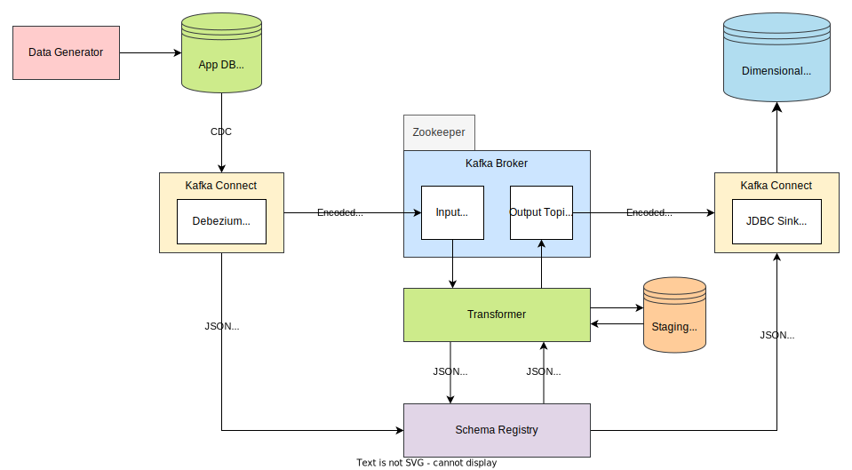

# Streaming ETL

This is an exploratory data engineering project to get some idea how Kafka can be utilized for ETL with streaming approach.

Some things are intentionally simplified. Language of choice is Python instead of Java.

## Architecture

## The goal and how it works

The main idea is to take a typical OLTP DB and stream changes to it via Change Data Capture down the pipeline to Dimensional Data Warehouse.

In absence of real transactional application a data generator is set up.

The changes are captured with Debezium which streams data to Kafka Broker. Transformer subscribes to new messages on input topics, transforms the data and writes it to output topics. These are connected to DWH via JDBC Sink Connector.

Kafka stores messages in binary format internally so these are also encoded/decoded with JSON Schema. Different services get their awareness of the actual schema via Schema Registry. Transformer also has models pregenerated from schemas which facilitate development and help with types and static analysis.

There are more descriptions for services in inner directories.
